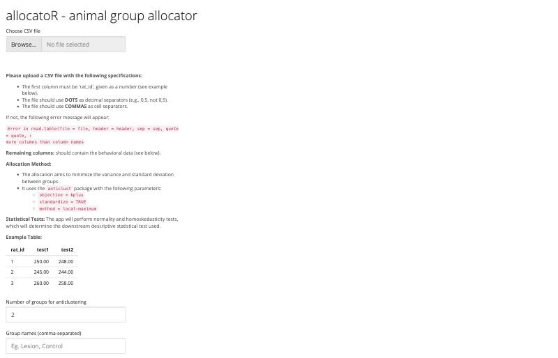
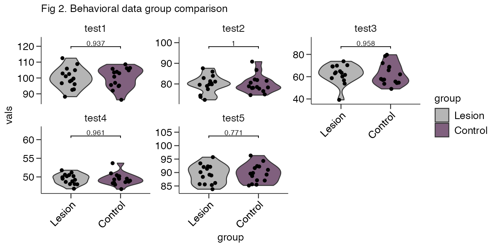
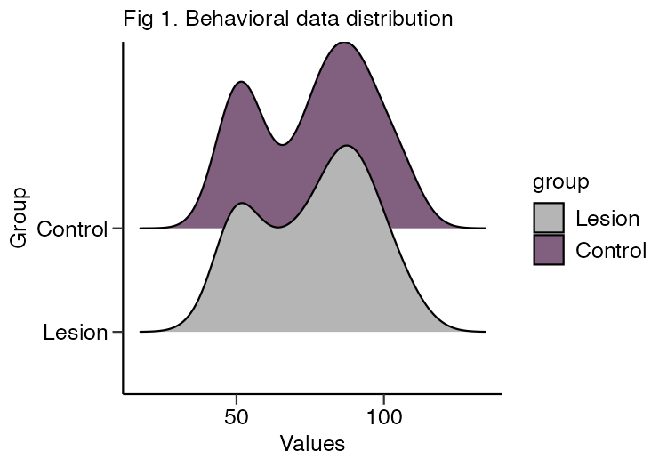

# allocatoR

Allocate animals to experimental groups that are as similar as possible.

allocatoR is an R Shiny app that takes a table of baseline behavioural measures
and assigns each animal to a group using the
[`anticlust`](https://cran.r-project.org/web/packages/anticlust/vignettes/anticlust.html)
package, minimising the differences between groups across every measure at once.
It then runs assumption checks and group comparisons so you can confirm the
allocation worked.

**Live app:** <https://hdm4xa-alrik-sch0rling.shinyapps.io/allocator/>



## Input format

A single CSV file:

- First column must be `rat_id`.
- Every remaining column is a numeric behavioural measure.
- Use **dots** as the decimal separator (`0.5`, not `0,5`).
- Use **commas** as the cell separator.

[`test_data.csv`](test_data.csv) is a randomly generated example with 30 animals
and 5 measures, ready to upload:

```csv
"rat_id","test1","test2","test3","test4","test5"
"1",95.2,78.5,68.3,49.5,87.1
"2",96.9,78.1,78.5,47.9,89.8
```

## Allocation

`anticlustering()` is called with:

- `objective = "kplus"` — minimises differences in both mean and variance
- `standardize = TRUE` — so measures on different scales contribute equally
- `method = "local-maximum"`

You choose the number of groups, their names, their sizes, and the random seed.
The seed is recorded so an allocation can be reproduced exactly.

## Statistical output

The app reports two assumption checks, **computed separately for each
behavioural measure**:

- **Shapiro-Wilk** test for normality
- **Levene's** test for homogeneity of variance

A single comparison method is then applied to every measure. Because one method
covers all panels, the strictest result governs — if any measure violates an
assumption, the more conservative method is used:

| Normality | Equal variance | Groups | Method |
| --------- | -------------- | ------ | ------ |
| fails | — | > 2 | Dunn's test (BH-adjusted) |
| fails | — | 2 | Wilcoxon rank-sum test |
| holds | fails | any | Welch's t-test |
| holds | holds | any | Student's t-test |

> **How to read the p-values.** These groups were *constructed* by
> anticlustering to be as similar as possible, so large p-values are the
> expected result and are not evidence of anything in the usual inferential
> sense. Treat them as a quality-control check that the allocation succeeded,
> not as a hypothesis test.

### Outputs

| Output | Contents |
| ------ | -------- |
| Allocation table (CSV) | `rat_id` and assigned group |
| Fig 1 (PDF) | distribution of all measures per group (ridgeline) |
| Fig 2 (PDF) | per-measure group comparison with p-values |
| Fig 3 (PDF) | per-measure values for each individual animal |

### Example output

Produced from [`test_data.csv`](test_data.csv), split into two groups of 15.
The p-values are all large, which is exactly what a successful allocation
looks like.





## Running locally

Dependencies are pinned with [renv](https://rstudio.github.io/renv/). Clone the
repository, restore the library, then start the app:

```bash
git clone https://github.com/alrikschorling/allocatoR.git
cd allocatoR
R -e 'renv::restore()'
R -e 'shiny::runApp(launch.browser = TRUE)'
```

`renv::restore()` installs the exact package versions recorded in `renv.lock`
into a project-local library, so it will not disturb your system R installation.
It only needs to be run once, or after `renv.lock` changes.

## Tests

```bash
Rscript tests/run-tests.R
```

The suite drives the app through `shiny::testServer` against `test_data.csv` and
covers allocation balance and reproducibility, the per-measure assumption checks
and test selection, every upload-validation path, and that each figure builds and
downloads as a valid PDF. It needs no packages beyond the app's own, and runs on
every push via [GitHub Actions](.github/workflows/tests.yml).

## License

[MIT](LICENSE)
